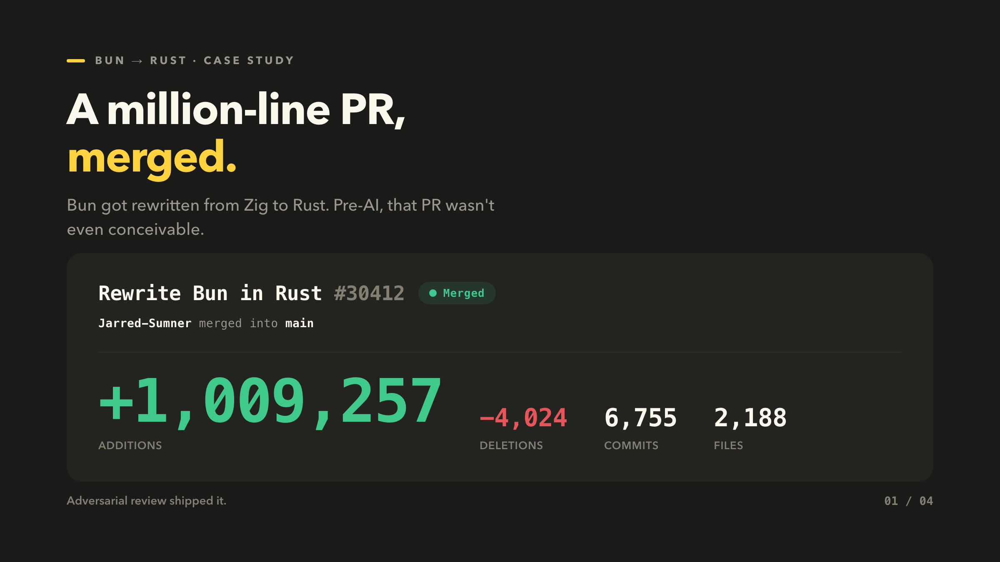
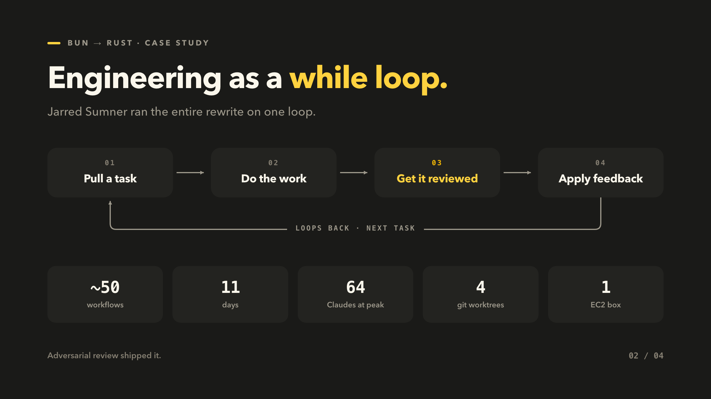
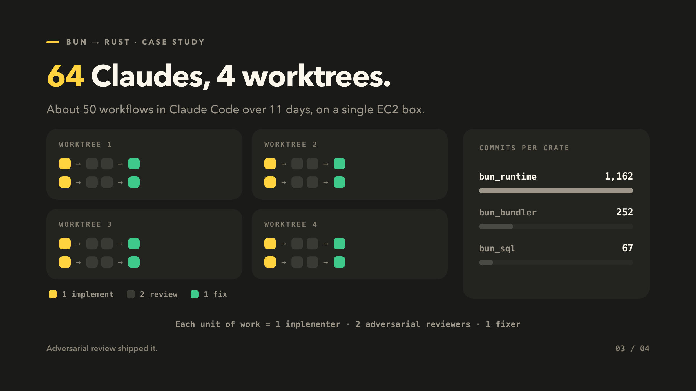
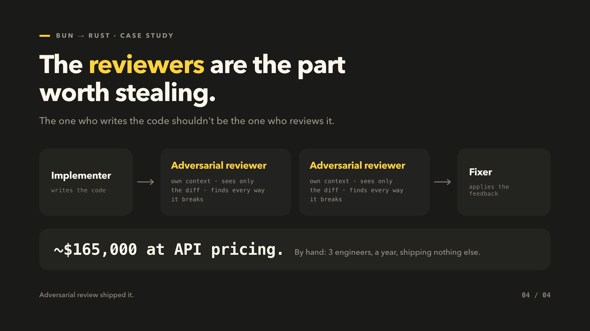

Bun, the popular JS runtime, was recently rewritten from Zig to Rust — a big moment for the JS ecosystem. I remember seeing the million-line pull request and thinking this wouldn't even have been conceivable pre-AI.

Bun's creator, Jarred Sumner, wrote up how he pulled it off. I gave a talk on the agentic engineering principles behind it; this is the written version. I don't know Zig or Rust, so I'll skip the language details and focus on the workflow — because the workflow is the interesting part.



## A normal engineering job is a while loop

Jarred framed a normal engineering job as a loop. You pull a task off the list, do the work, get it reviewed, apply the feedback, move to the next task.

```javascript
while ((task = todoList.pop())) {
  const result = task();
  const feedback = await Promise.all([review(result), review(result)]);
  await apply(feedback, result);
}
```

Pull a task. Do the work. Get it reviewed. Apply the feedback. Next task. He ran the entire rewrite on this.

Notice the two reviews. They run in parallel, and they are not the writer. Hold onto that — it's the whole point.



## ~3 hours of planning before any code

Jarred spent about three hours planning the rewrite with Claude before writing a line of code.

The output was a porting guide, `PORTING.md`, that mapped Bun's Zig patterns onto Rust. The goal was narrow on purpose: a mechanical, behavior-preserving port that passed the existing test suite, with Rust's safety benefits coming for free. He went back and forth until he trusted the plan.

The port then ran in two phases:

- **Phase A — translate every file.** Each `.zig` file became a `.rs` file. It did not need to compile. It just had to match the Zig faithfully: same function names, same structure.
- **Phase B — make it compile.** Crate by crate — a crate being a Rust module or library.

Splitting "translate faithfully" from "make it compile" is what kept each unit of work small enough for an agent to own.

## 64 Claudes at peak

Jarred ran the port as roughly 50 dynamic workflows in Claude Code, over 11 days.

At peak:

- **4** workflows running in parallel
- **4** git worktrees, one per workflow
- **16** Claudes per worktree
- **1** EC2 instance running all of it

That's about 64 Claudes at once. The 16 in each worktree broke into four concurrent loops, and each loop was four Claudes with distinct roles.

One nice detail from the trenches: early on it was mysteriously slow for no clear reason. He'd forgotten to raise the instance's default IOPS, so a single slow `grep` could freeze disk I/O for minutes.



## One implementer, two adversarial reviewers, one fixer

Each loop was four Claudes with distinct roles:

- **Implementer** — writes the code.
- **Adversarial reviewer** — hunts for every way it breaks.
- **Adversarial reviewer** — a second one, doing the same.
- **Fixer** — applies the feedback.

That's the `while` loop from the top, made real: one writer, two independent reviews running in parallel, one pass to apply what they found. Then the next task.

## Bun ships inside other people's products

Shipping a rewrite this size needed confidence. Bun isn't a side project — it's critical infrastructure for millions of developers, and it ships inside products like Claude Code and platforms like Vercel, Railway, and DigitalOcean.

So the new code had to keep the old behavior, exactly. That, not the language, was the whole problem.

## The reviewer sees only the diff

Jarred's answer was adversarial review — the same instinct you'd have without AI. The person who writes the code shouldn't be the one who reviews it, because knowing what the code is *supposed* to do biases you toward seeing what you meant instead of what you wrote.

So he isolated the reviewer's context completely:

- **Separate context window.** The reviewer never sees the writer's reasoning — only the diff.
- **Two per implementer.** Both told to find every way it could break.
- **The brief.** Imagine the maintainer who hates you.

This ran through Phase A and Phase B, start to finish — the mechanism that kept the port correct the whole way.



## ~$165,000, or a year of three engineers

Pre-merge, at API pricing, this took:

- **5.9B** uncached input tokens
- **690M** output tokens
- **72B** cached input reads

That's around **$165,000**.

By hand, Jarred estimates it would have taken three engineers with full context on the codebase about a year — a year in which they couldn't ship bug fixes, security fixes, or features. As he put it: they never would have done it.

## Confidence came from adversarial review

The tokens and the worktrees are the flashy part, but they aren't the lesson. The lesson is that the confidence to ship came from adversarial review — keeping the writer out of the reviewer's seat, even when the writer is a model.

Which leaves the question worth chewing on:

**Who reviews the code your agents write?**
