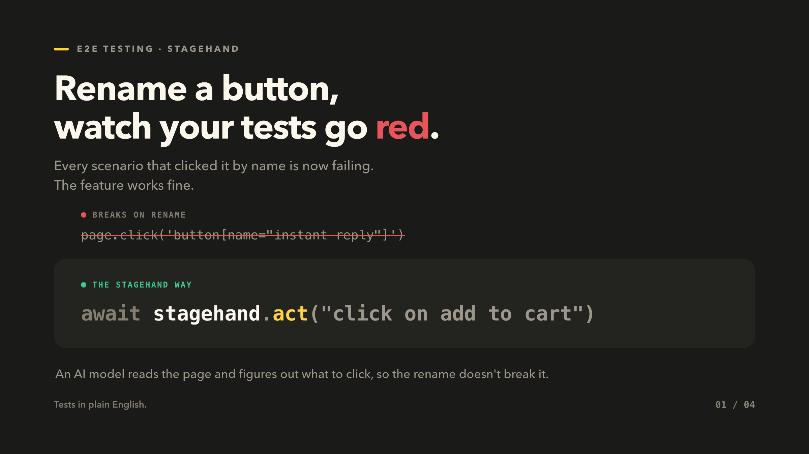
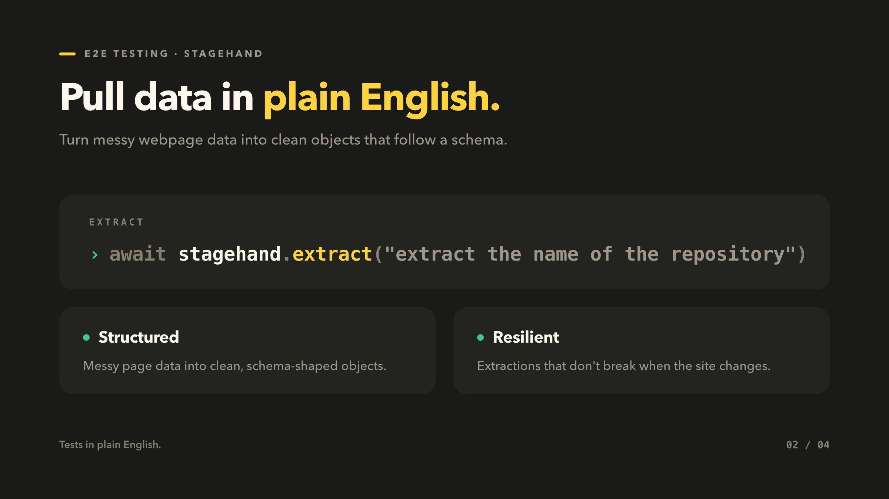
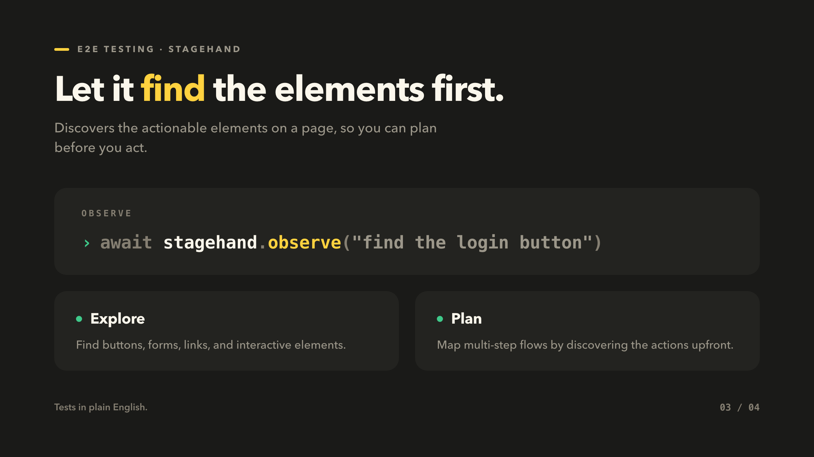
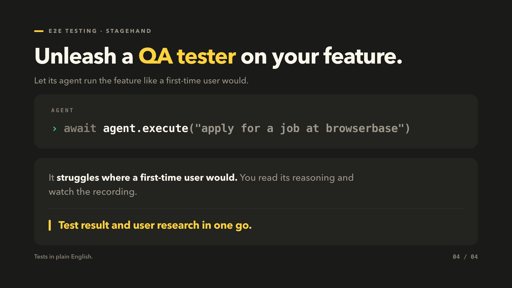

I gave a short talk on this in our weekly dev call. This is the written version.

A recent talk in our group nudged us to explore adjacent fields and pick up generalized knowledge: design, testing. Testing is the one I had explored least, so I spent the week on it.

I'm still new to it. But I found a library worth sharing: Stagehand.

## The rename problem

End-to-end tests drive your app the way a user would: open the page, click the button, check the result.

The pain shows up when the UI changes. Say a button called "instant reply" gets renamed to "quick reply". Every test that clicks "instant reply" now fails, along with every scenario that passes through it. The feature still works. The tests don't know that.

## What Stagehand is

[Stagehand](https://stagehand.dev/) is an end-to-end testing library by Browserbase, built on top of Playwright. Playwright lets you do web automation and testing; Stagehand sits on top of it and lets you write the steps in natural language.

```ts
await stagehand.act("click on add to cart");
```

The instruction reads like a sentence. An AI model looks at the page and works out what to click. In the rename case above, "click the reply button" still finds the button after the label changes, so that test keeps passing.

## The four APIs

**act** performs individual actions on a page.

```ts
await stagehand.act("click on add to cart");
```



**extract** grabs data from a page. You can define a schema for the result, or just ask.

```ts
await stagehand.extract("extract the name of the repository");
```



**observe** turns a page into a checklist of reliable, executable actions. You ask it something like "find the login button" and it returns structured actions you can execute or validate before acting.

```ts
await stagehand.observe("find the login button");
```



**agent** takes a whole task, not a step.

```ts
await agent.execute("apply for a job at browserbase");
```

The agent doesn't know where anything in your app lives. It has to find its way around, the same way a user who just landed on your product would.



## The part that got me: the agent as a QA tester

Because the agent explores like a first-time user, it struggles where a first-time user would struggle.

So you can point it at a feature and let it act as a QA tester:

- read its reasoning while it works through the page
- record videos of the runs and watch them back
- see where it got stuck, and improve the UI/UX there

One run gives you a test result and a piece of user research.

## Where I landed

A week in, testing feels a lot more approachable than I expected, and this library is a big part of why. The test cases read like the sentences I would say to a teammate sitting next to me.

If you already live in Playwright, Stagehand is worth a look just for the rename problem alone.
